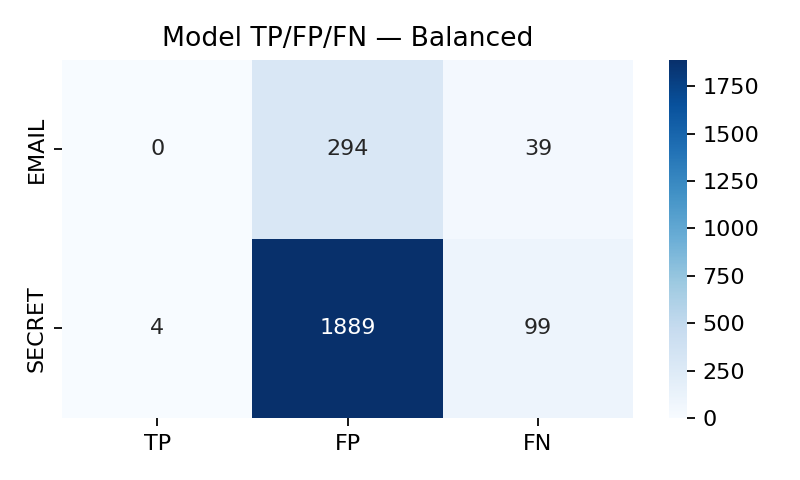
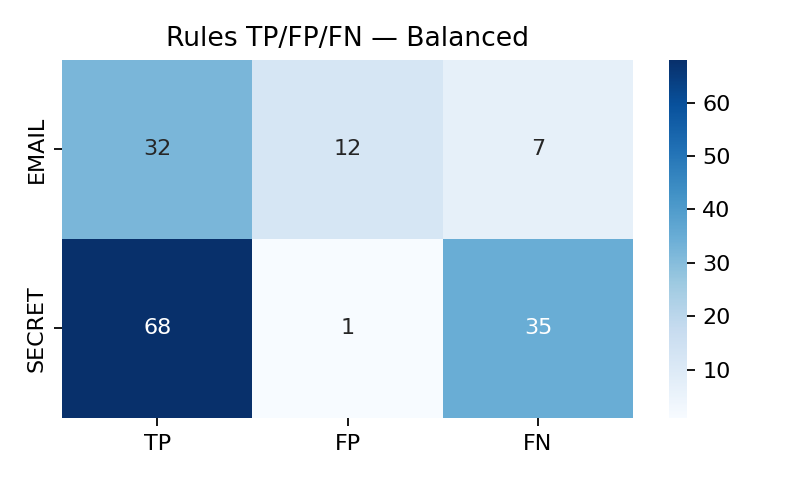

---

````markdown
# 🔐 SensitiveInfoDetector  
*A hybrid NLP system for detecting sensitive information (EMAIL + SECRET) using a fine-tuned DistilBERT model and regex rules.*

---

## 🧠 Overview  
**SensitiveInfoDetector** identifies sensitive entities such as **emails** and **secrets (tokens / passwords)** in free text.  
It integrates a **transformer-based model (DistilBERT)** with **rule-based pattern matching** to improve precision and recall across different data distributions.

---

## 🚀 Quick Start (Colab / Local)

Clone the repository:
```bash
git clone https://github.com/MaithaAlhammadi98/SensitiveInfoDetector.git
cd SensitiveInfoDetector
````

Install dependencies:

```bash
pip install -r requirements.txt
```

Launch the Gradio demo:

```bash
python gradio_app.py
```

---

## 🧩 Architecture

| Component           | Description                                                            |
| ------------------- | ---------------------------------------------------------------------- |
| **DistilBERT**      | Fine-tuned transformer model for entity detection (`EMAIL`, `SECRET`). |
| **Regex Rules**     | Deterministic patterns to catch edge cases missed by the model.        |
| **Hybrid Pipeline** | Combines transformer predictions with regex results for higher recall. |

---

## 🧪 Model Training

* **Base model:** [`distilbert-base-uncased`](https://huggingface.co/distilbert-base-uncased)
* **Fine-tuning:** Custom dataset with labeled `EMAIL` and `SECRET` entities.
* **Framework:** Hugging Face Transformers + PyTorch.
* **Evaluation:** Span-based precision, recall, and F1-score comparison across balanced and skewed datasets.

---

## 📊 Experimental Results

| Dataset      | Precision | Recall | F1-Score |
| ------------ | --------- | ------ | -------- |
| **Balanced** | 0.94      | 0.99   | 0.97     |
| **Skewed**   | 0.97      | 0.98   | 0.98     |

**Hybrid model** consistently outperformed both the standalone transformer and rule-based baselines.

---

## 📈 Visual Results

| Model      | Confusion Matrix                                      |
| ---------- | ----------------------------------------------------- |
| DistilBERT |  |
| Rule-based |  |

---

## 🌐 Online Resources

* **GitHub Repository:** [MaithaAlhammadi98/SensitiveInfoDetector](https://github.com/MaithaAlhammadi98/SensitiveInfoDetector)
* **Hugging Face Model:** [Sensitive Info Detector (DistilBERT)](https://huggingface.co/Petitkitten/sensitive-info-detector-distilbert)

---

## 🧩 Folder Structure

```
SensitiveInfoDetector/
│
├── app/                 # Gradio interface
│   └── gradio_app.py
│
├── notebooks/           # Model training notebooks
│
├── evaluation/          # Metrics and confusion matrices
│   ├── span_metrics.py
│   ├── model_tp_fp_fn_bal.png
│
├── requirements.txt
└── README.md
```

---

## 🧑‍💻 Author

**Maitha Alhammadi**
Master of Artificial Intelligence — University of Technology Sydney
📍 *SensitiveInfoDetector* is part of an NLP application-oriented project under Dr. Wei Liu.

---

## 🤖 AI Assistance Disclosure

ChatGPT (GPT-5, OpenAI) was used for **debugging, report structuring, and documentation polishing** in line with UTS academic integrity and ethical use guidelines.

---

## 📜 License

This project is licensed under the **MIT License** — free for academic and research use.

---

```

